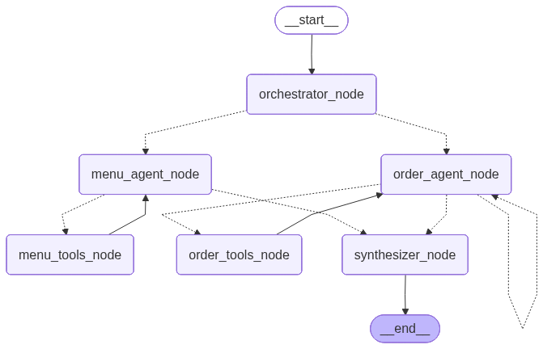

# DishPatch

A mocked out multi-agent food delivery assistant (via CLI) that accepts natural language queries, routes them to specialist agents, and returns a unified response — with semantic menu search, order tracking, and human-in-the-loop interrupts.

Named after the dual meaning of *dispatch* (routing) and *dish* (food).



## How It Works

You type a query. The system:

1. **Routes intent** — an orchestrator LLM classifies the query and dispatches to the right agent(s) using structured output and parallel Send()
2. **Searches the menu** — the Menu Agent runs a semantic search against a ChromaDB vector store, using OpenAI embeddings to match queries like "creamy Indian food" or "vegan under $300"
3. **Tracks orders** — the Order Agent looks up orders by Order ID, Tracking ID, or email. If no identifier is found, it pauses via `interrupt()` and asks the user before resuming
4. **Merges responses** — a Synthesizer node combines outputs from one or both agents into a single, coherent reply
5. **Maintains memory** — `MemorySaver` persists state across turns so the conversation stays contextual

## Architecture

```
Voice / Text Input
        │
        ▼
  ┌─────────────────┐
  │  Orchestrator   │  ← Structured output routing (Pydantic + Send())
  └────────┬────────┘
           │  parallel dispatch
    ┌──────┴──────┐
    ▼             ▼
┌────────┐  ┌────────────┐
│  Menu  │  │   Order    │  ← Each runs its own tool-calling loop
│ Agent  │  │   Agent    │
└───┬────┘  └─────┬──────┘
    │              │  interrupt() → HITL → resume
    └──────┬───────┘
           ▼
    ┌─────────────┐
    │ Synthesizer │  ← Merges responses into one reply
    └──────┬──────┘
           ▼
      Text Output
```

## Tech Stack

| Component | Technology | Why |
|-----------|-----------|-----|
| Agent orchestration | LangGraph | StateGraph with parallel dispatch, conditional edges, HITL |
| LLM | GPT-4o-mini | All nodes — best cost/performance ratio |
| Vector search | ChromaDB + LangChain | In-memory RAG for semantic menu search |
| Embeddings | OpenAI text-embedding-3-small | Dense semantic vectors for menu retrieval |
| Structured routing | Pydantic + `with_structured_output` | Forces validated JSON routing decisions |
| Memory | LangGraph MemorySaver | Multi-turn conversation + HITL checkpoint/resume |
| Config | YAML + Python constants | All tunable params in one file, no magic numbers |

## Project Structure

```
DishPatch/
├── dishpatch/
│   ├── nodes/
│   │   ├── orchestrator.py    # Structured-output router, parallel Send() dispatch
│   │   ├── menu_agent.py      # RAG-powered menu search with tool-calling loop
│   │   ├── order_agent.py     # Order lookup with HITL interrupt() on missing ID
│   │   └── synthesizer.py     # Merges agent responses into a single reply
│   ├── prompts/
│   │   ├── orchestrator.txt   # Routing rules + output format instructions
│   │   ├── menu_agent.txt     # Menu search guidelines + few-shot examples
│   │   └── order_agent.txt    # Order lookup guidelines + few-shot examples
│   ├── data/
│   │   ├── menu.py            # 8-dish typed menu catalog (MenuItem dataclass)
│   │   └── orders.py          # 5-order typed database (Order dataclass)
│   ├── tools/
│   │   ├── rag.py             # ChromaDB vector store + retriever
│   │   ├── menu_tools.py      # search_menu_catalog @tool
│   │   └── order_tools.py     # get_order_status @tool (ID / tracking / email)
│   ├── config.yaml            # Models, temperatures, RAG top_k, max iterations
│   ├── config.py              # YAML loader + exported constants
│   ├── graph.py               # StateGraph definition, ToolNodes, MemorySaver
│   ├── llms.py                # ChatOpenAI instances per role
│   ├── models.py              # StackState TypedDict + RouteDecision Pydantic model
│   ├── prompts.py             # Prompt file loader + exported constants
│   ├── logger.py              # Centralized logging setup
│   └── main.py                # CLI entry point, REPL loop, HITL handler
├── graph.png                  # Auto-generated graph visualization
├── pyproject.toml
└── .env.example
```

## Setup

**Requirements:** Python 3.11+, OpenAI API key

```bash
git clone <repo-url>
cd DishPatch
```

**Install**

```bash
uv pip install -e .
# or: pip install -e .
```

**Configure**

```bash
cp .env.example .env
# Add OPENAI_API_KEY to .env
```

**Run**

```bash
python -m dishpatch.main
```

**Commands**

| Input | Action |
|-------|--------|
| Any natural language | Routed to the right agent(s) |
| `reset` | Starts a fresh conversation thread |
| `quit` | Exits the assistant |

## Configuration

All tunable parameters live in `config.yaml` — no code changes needed:

```yaml
models:
  orchestrator: "gpt-4o-mini"
  menu_agent: "gpt-4o-mini"
  order_agent: "gpt-4o-mini"
  synthesizer: "gpt-4o-mini"
  embeddings: "text-embedding-3-small"

temperatures:
  orchestrator: 0.0   # Deterministic routing
  menu_agent: 0.7     # Creative food descriptions
  order_agent: 0.0    # Precise order lookups

rag:
  top_k: 3            # Number of menu results to retrieve

agents:
  max_tool_iterations: 5
```

## Key Concepts

| Concept | Where |
|---------|-------|
| Structured output routing | `nodes/orchestrator.py` — `llm.with_structured_output(RouteDecision)` |
| Parallel dispatch | `nodes/orchestrator.py` — `Command(goto=[Send(...), Send(...)])` |
| RAG | `tools/rag.py` — ChromaDB + OpenAI embeddings + LangChain retriever |
| Tool-calling loop | `nodes/menu_agent.py`, `nodes/order_agent.py` — agent ↔ ToolNode cycle |
| Human-in-the-Loop | `nodes/order_agent.py` — `interrupt()` + `Command(resume=value)` |
| Multi-turn memory | `graph.py` — `MemorySaver` checkpointer with thread IDs |

## Known Limitations

- Menu catalog and order database are in-memory — no persistence between runs
- ChromaDB vector store rebuilds on every startup
- Order agent can only look up existing orders — no order placement
- Voice I/O not implemented (bonus phase skipped)
- Parallel agent responses occasionally race when both agents complete near-simultaneously
